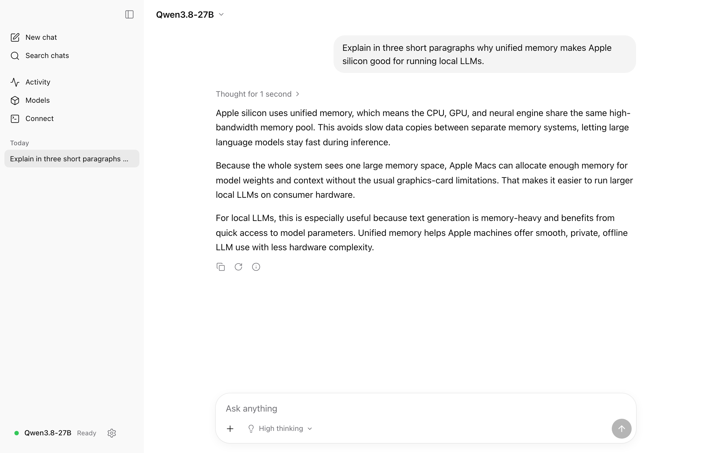
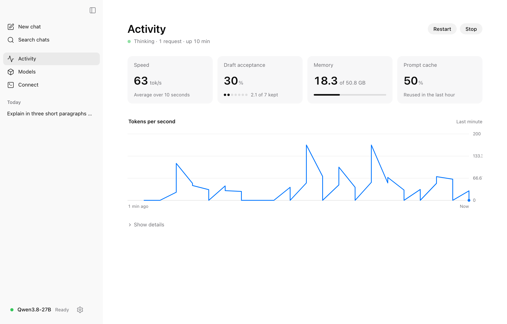
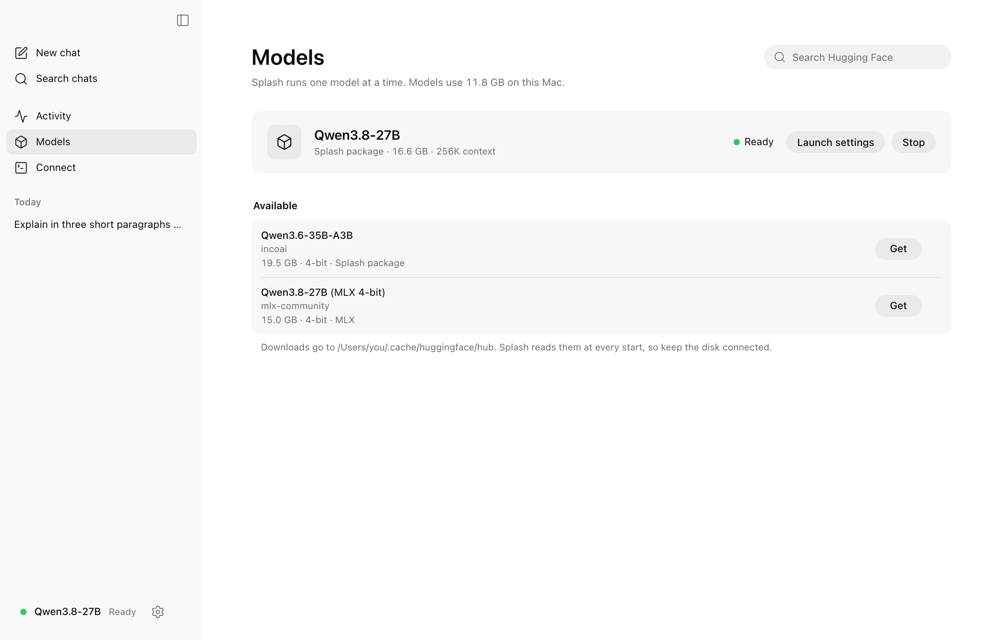
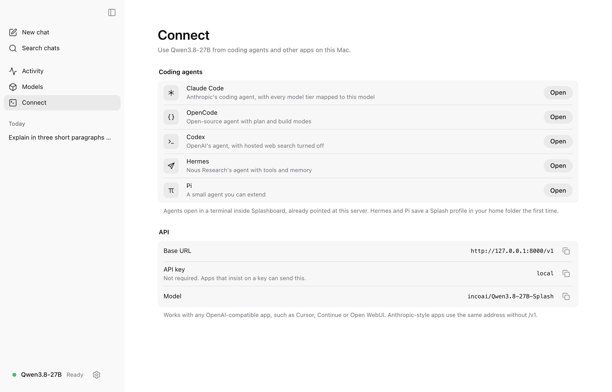

# Splashboard

Splashboard is a native macOS desktop app for [Splash](https://github.com/incoai/splash),
Inco's local inference engine for Apple silicon. It starts and stops the engine,
shows live telemetry, manages models and launch settings, connects coding agents,
and gives you a chat interface. Splashboard is built from scratch with Tauri 2,
React and TypeScript.

> **Not affiliated with Inco.** Splashboard is an independent open-source project.
> "Splash" refers to Inco's engine, which Splashboard drives through its public
> CLI and HTTP API.

<picture>
  <source media="(prefers-color-scheme: dark)" srcset="docs/screenshots/chat-dark.png">
  
</picture>

<table>
  <tr>
    <td><picture><source media="(prefers-color-scheme: dark)" srcset="docs/screenshots/activity-dark.png"></picture></td>
    <td><picture><source media="(prefers-color-scheme: dark)" srcset="docs/screenshots/models-dark.png"></picture></td>
  </tr>
  <tr>
    <td align="center">Activity</td>
    <td align="center">Models</td>
  </tr>
  <tr>
    <td colspan="2"><picture><source media="(prefers-color-scheme: dark)" srcset="docs/screenshots/connect-dark.png"></picture></td>
  </tr>
  <tr>
    <td colspan="2" align="center">Connect</td>
  </tr>
</table>

Status: early (0.1). Every screen is wired to Splash 1.2 and 1.3:

- **Chat**: streamed replies with thinking, Stop, Regenerate, image attachments,
  saved history and a thinking-level picker. Sending starts the model if needed.
- **Activity**: live decode speed, draft acceptance, memory and prompt-cache use
  from `/status`, a tokens-per-second chart, details and the server log.
- **Models**: installed Splash packages and MLX 4-bit models, downloads with
  progress, and Launch settings for every `splash serve` flag (presets per Mac
  memory size, and the equivalent command).
- **Connect**: Claude Code, OpenCode, Codex, Hermes and Pi in a built-in
  terminal, plus the OpenAI- and Anthropic-compatible endpoints.
- **Settings** and a **first-run** flow (install Splash with Homebrew, download a
  model, start it).

The design reference is `design/minimal-ref/` (open `index.html`).

## Install

Download `Splashboard_0.1.0_aarch64.dmg` from the
[latest release](https://github.com/ksg98/splashboard/releases/latest), open it
and drag Splashboard to Applications. The app is signed with a Developer ID and
notarized by Apple. On first launch it offers to install Splash with Homebrew
and download a model if you don't have them yet.

## Requirements

- A Mac with Apple silicon, macOS 14 or later (Splash runs only on Apple silicon)
- Splash 1.2+ installed with Homebrew (`splash --version`); 1.3.0 recommended
- Node.js 22+ and pnpm 11 (`corepack enable`)
- Rust (stable, 1.85+) and Xcode Command Line Tools, for the Tauri shell

## Development

```sh
pnpm install       # JS dependencies (the Rust crates build on first `dev`)
pnpm dev           # desktop app: Vite + Tauri window (tauri dev)
pnpm web           # browser only: Vite on http://localhost:1420
pnpm build         # release .app / .dmg (tauri build)
pnpm typecheck     # tsc --noEmit (app + node configs)
pnpm test          # vitest run
pnpm lint          # eslint, zero warnings allowed
pnpm check:rust    # cargo check + cargo test in src-tauri
```

### Signed builds

`pnpm build` makes an unsigned `.app` and `.dmg` in
`src-tauri/target/release/bundle/`. To sign them with your own Developer ID,
set the identity when you build:

```sh
APPLE_SIGNING_IDENTITY="Developer ID Application: Your Name (TEAMID)" pnpm build
```

`security find-identity -v -p codesigning` lists the identities on your Mac.
Notarization also needs `APPLE_ID`, `APPLE_PASSWORD` (an app-specific password)
and `APPLE_TEAM_ID`; without them the app is signed but Gatekeeper still asks
before the first launch.

### Browser mode (`pnpm web`)

`pnpm web` runs the UI in a normal browser (or Playwright) without the Tauri
webview. Requests to Splash go to `/splash/*` on the Vite dev server, which
proxies them to `http://127.0.0.1:8000`. You can change the target with
`SPLASH_URL` (see `.env.example`). Start Splash yourself first, for example
`splash serve --model incoai/Qwen3.8-27B-Splash`. Engine control (start/stop,
logs) needs the desktop app; in browser mode `engine.available` is `false`.

## Architecture

```
src-tauri/                  Rust (Tauri 2)
  src/lib.rs                plugin setup, command registration, stop engine on exit
  src/error.rs              AppError -> { kind, message } for the frontend
  src/transport/            HTTP to Splash: splash_request, splash_stream(+_cancel),
                            splash_config_get/_set
  src/splash/               engine supervisor
    detect.rs               find the splash CLI (PATH, /opt/homebrew/bin) + version
    options.rs              typed `splash serve` flags -> argv/env
    supervisor.rs           spawn in own process group, logs, /ready polling,
                            SIGINT -> SIGTERM -> SIGKILL
    events.rs               engine://state and engine://log payloads
    commands.rs             engine_detect/start/stop/state/logs
src/
  main.tsx                  entry
  app/                      shell: router, layout, nav, theme, feature registry
  features/<name>/          one folder per feature (see below)
  components/ui/            shared primitives (filled by the design step)
  lib/
    splash/transport*.ts    Transport interface, TauriTransport, HttpTransport
    splash/sse.ts           SSE parser
    splash/client.ts        typed Splash client (health, ready, status, models, chatStream)
    splash/types.ts         API types (minimal; see docs/splash-api.md)
    splash/engine.ts        engine_* / splash_config_* bindings and event listeners
    splash/engine-store.ts  shared engine state (zustand), fed by engine events
    storage.ts              settings + conversations storage (plugin-store / localStorage)
    format.ts               number, byte, token and duration formatters
  styles/                   tokens.css (design tokens), index.css (Tailwind mapping), base.css
  test/                     vitest setup and render helpers
docs/splash-api.md          the Splash HTTP API contract this app relies on
fixtures/splash-1.2.0/      recorded Splash responses for tests
```

### Why the webview never calls Splash directly

Splash refuses any request whose `Origin` header names an origin other than its
own (`server/http_security.py`). The webview's origin (`tauri://localhost`, or
`http://localhost:1420` in dev) is never Splash's. So every request goes through
a transport:

- **Desktop:** `TauriTransport` calls the Rust commands. Rust uses reqwest to talk
  to `http://127.0.0.1:<port>`. It never sends `Origin`, bypasses any system proxy,
  and adds the API key so the key never lives in the webview. Streams come back
  through a `tauri::ipc::Channel` as `start` → `chunk`… → `done` | `error` events.
  The SSE parser in TypeScript frames those chunks.
- **Browser dev:** `HttpTransport` fetches `/splash/*`. The Vite proxy removes
  `Origin`/`Referer` and rewrites `Host`.

`getTransport()` picks the right one by checking `'__TAURI_INTERNALS__' in window`.

### Engine supervisor

`engine_start(options)` finds `splash` and refuses to start if the port is
already taken (so it can't mistake someone else's server for its own). It then
runs `splash serve --model=… --port=…` in its own process group. The API key is
passed as `SPLASH_API_KEY` in the environment, never in argv. stdout and stderr
lines are sent as `engine://log` events. State changes (`starting` → `ready`
once `/ready` returns 200 → `stopping` → `exited`/`failed`) are sent as
`engine://state` events. `engine_stop` sends SIGINT to the group, then SIGTERM,
then SIGKILL, waiting between each. The same stop also runs when the app quits.

### Window

The window uses an overlay title bar (`titleBarStyle: "Overlay"`,
`hiddenTitle: true`), so the content runs under the traffic lights. The shell's
top bar is a drag region (`data-tauri-drag-region`) and is padded by
`--sb-traffic-lights-width`. The window is 1280×820 and can't be resized below
960×640.

### Styling

Tailwind v4 provides utilities only. Every colour, radius and font comes from the CSS
variables in `src/styles/tokens.css`. `index.css` maps them onto Tailwind
(`bg-surface`, `text-fg-muted`, `rounded-md`, `font-mono`…) and removes the default
palette. Themes switch on `<html data-theme="light|dark">`. The theme follows the
system setting unless the user picks one. The current token values are neutral
placeholders until the design is chosen.

## Working in parallel: who edits what

The scaffold is set up so several people or agents can build features at the
same time without touching the same files.

| Path                                                                                                                                                                      | Owner                                                                                 |
| ------------------------------------------------------------------------------------------------------------------------------------------------------------------------- | ------------------------------------------------------------------------------------- |
| `src/features/<name>/**`                                                                                                                                                  | that feature only: its page, sub-routes (`routes.ts`), store, tests, local components |
| `src/components/ui/**`                                                                                                                                                    | design-system step only (see its README); features import, don't edit                 |
| `src-tauri/src/splash/**`                                                                                                                                                 | engine/supervisor work only, coordinated                                              |
| `src/styles/tokens.css`                                                                                                                                                   | design integration step only                                                          |
| `design/**`, `docs/splash-api.md`, `fixtures/**`                                                                                                                          | design and API-contract work                                                          |
| everything else (`package.json`, lockfile, `Cargo.toml`, configs, `src/app/**`, `src/lib/**`, `src-tauri/src/{lib,error}.rs`, `src-tauri/src/transport/**`, capabilities) | frozen: change through a coordinated PR                                               |

Features never import each other (ESLint enforces this). Shared code goes in
`src/lib` or `src/components/ui`. All dependencies are already installed, so
feature work shouldn't need to change `package.json` or `Cargo.toml`.

A feature plugs in through its `routes.ts`, which exports a `FeatureDefinition`
(path, layout `shell` | `bare`, nav entry, route object). Add sub-routes, loaders
and error boundaries there. The onboarding feature decides where `/` goes, via
`resolveStartPath()` in `src/features/onboarding/start.ts`.

## License

[Apache-2.0](LICENSE). Copyright 2026 Splashboard contributors.
